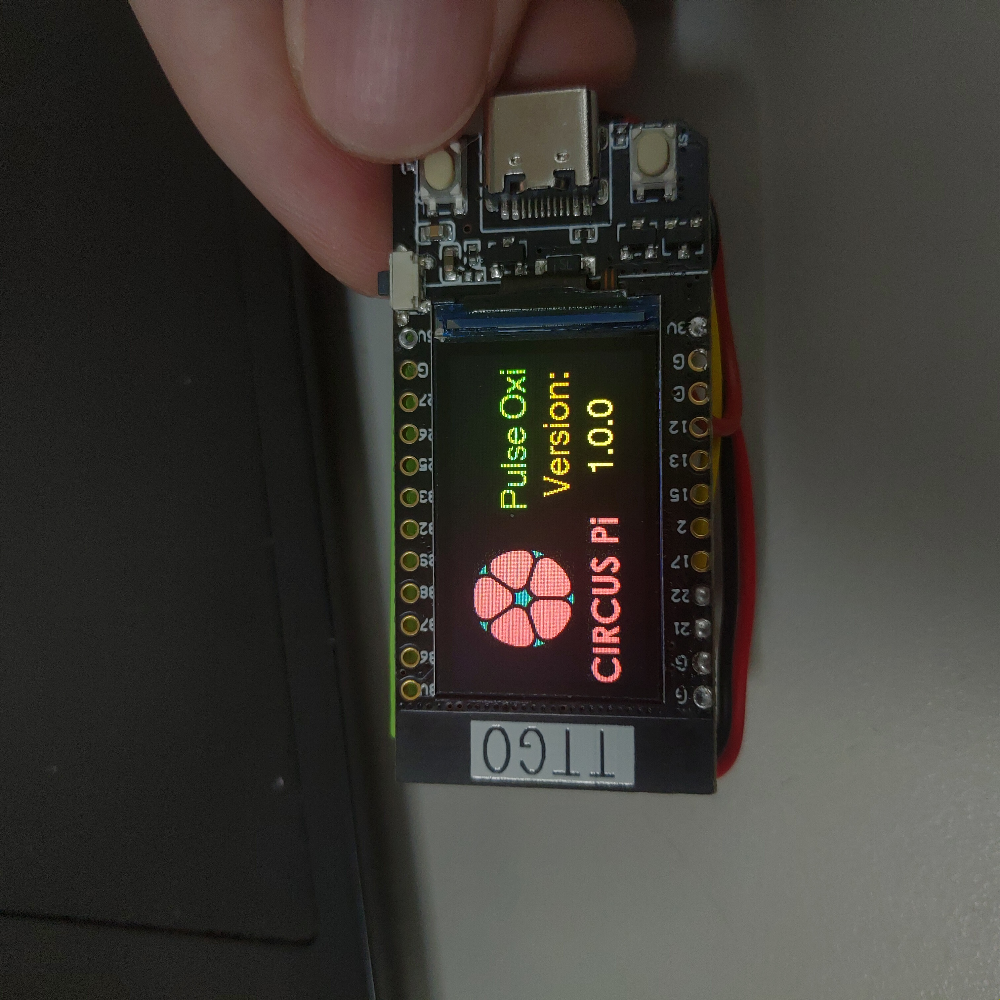
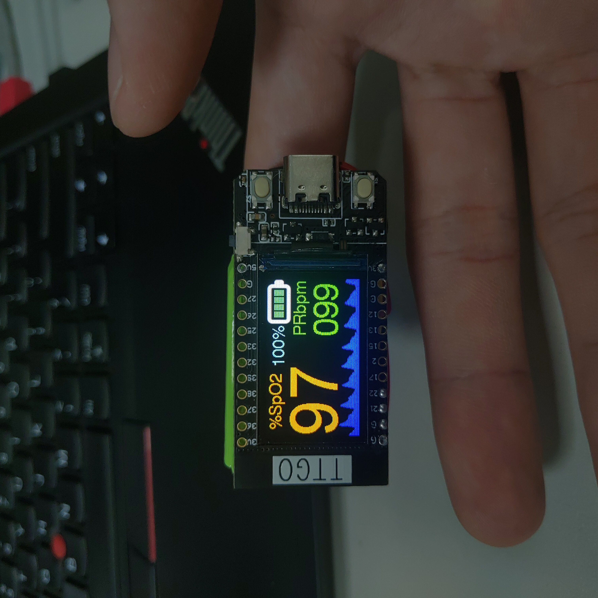
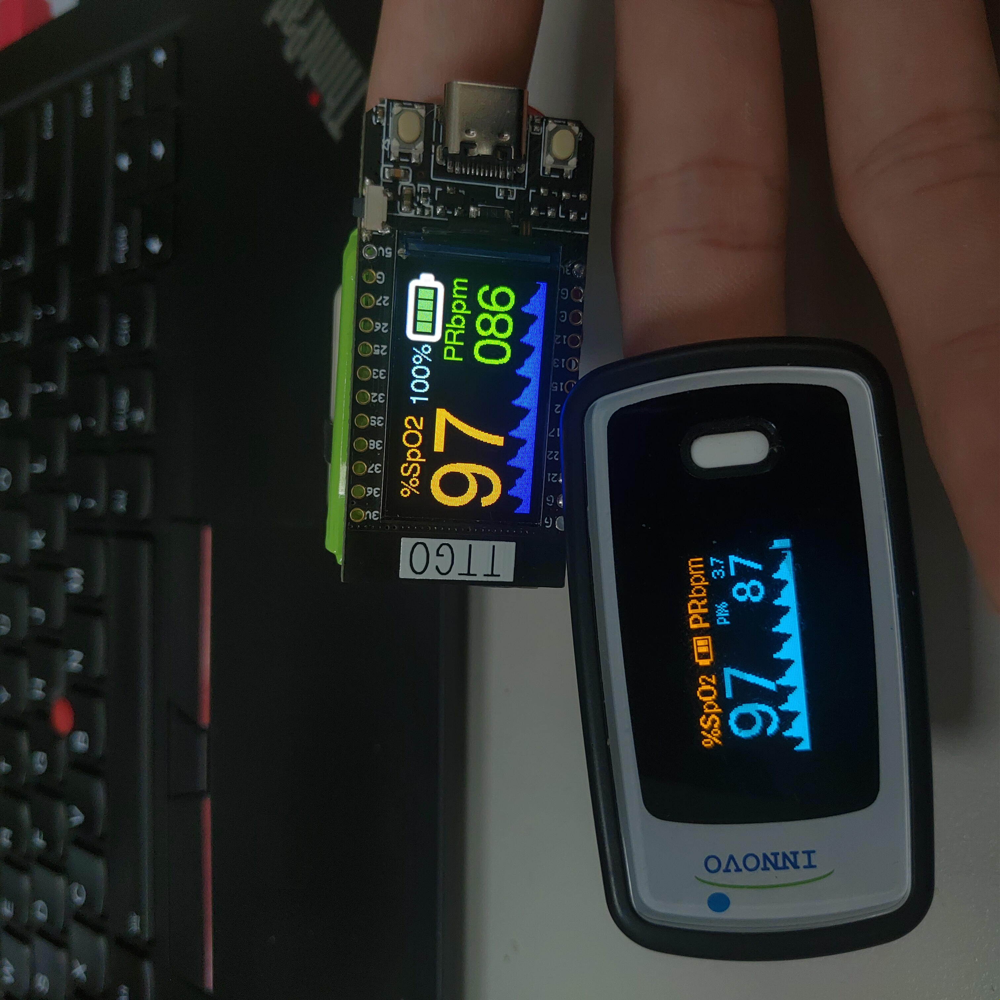
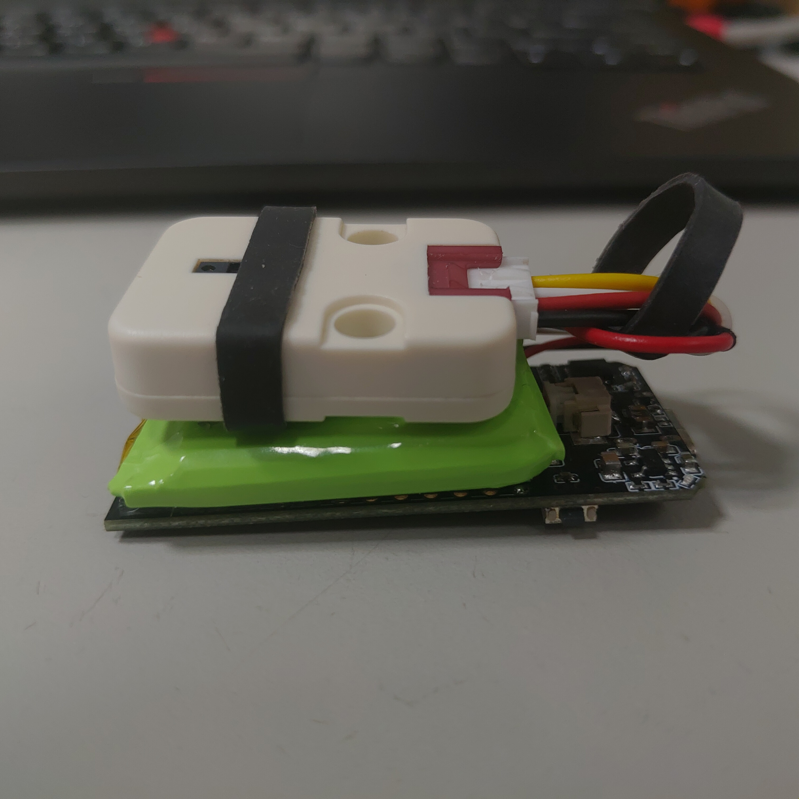
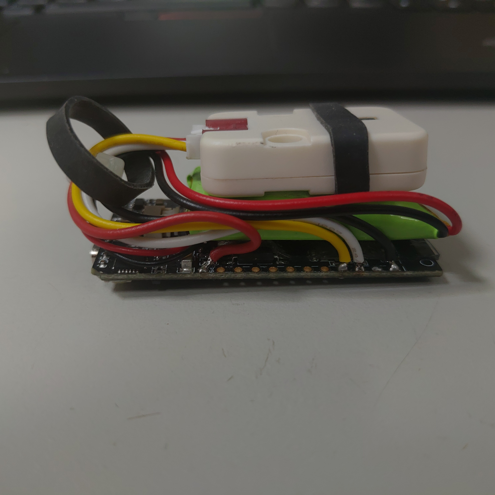

# Fingertip Pulse Oximeter (指尖脈搏血氧儀)

## 免責聲明
此Project僅用於教育目的，不用於醫療用途。使用它需要您自擔風險。
## Hardware
* [TTGO T-Display ESP32 CH9102 WiFi 模組(16MB)](https://www.icshop.com.tw/product-page.php?28572)
* [MAX30100 血氧感測器模組](https://www.icshop.com.tw/product-page.php?28034)
* [聚合物鋰電池-500mAh 3.7V](https://www.icshop.com.tw/product-page.php?14047) (JST Connector不相容，代替換)

## Development Platform
* Arduino IDE 1.8.16
* Board Config ESP32 Dev Module
## From Arduino Library Manager
* [LittleFS_esp32 (V1.0.6)](https://github.com/lorol/LITTLEFS)
* [TJpg_Decoder (V1.0.5)](https://github.com/Bodmer/TJpg_Decoder)
## From Github
* [Arduino-MAX30100 (969b0ba)](https://github.com/CIRCUSPi/Arduino-MAX30100)
* [TFT_eSPI (f6c8ad2)](https://github.com/CIRCUSPi/TFT_eSPI/tree/TTGO_T_Display)
* [18650CL (e1be2aa)](https://github.com/pangodream/18650CL)
* [U8g2_for_TFT_eSPI (a170ef8)](https://github.com/Bodmer/U8g2_for_TFT_eSPI)

## 硬體接線
* TTGO IO21(SDA) >> MAX30100 SDA
* TTGO IO22(SCL) >> MAX30100 SCL
* LiPo Batter 500mah >> TTGO JST 1.25mm Connector

## 注意事項
* MAX30100使用400K高速I2C，因此盡量將SDA、SCL線長控制在10cm以內，以降低傳輸失敗的機率。

## 實際電量%數對應電壓
|  電壓   | 電量%數  |
|  ----  | ----  |
| 4.15  | 100% |
| 4.10  | 97% |
| 4.00  | 85% |
| 3.90  | 67% |
| 3.80  | 47% |
| 3.70  | 17% |
| 3.60  | 9% |
| 3.50  | 5% |
| 3.30  | 3% |
| 3.20  | 0% |

## ESP32 Sleep Mode
[Insight Into ESP32 Sleep Modes & Their Power Consumption](https://lastminuteengineers.com/esp32-sleep-modes-power-consumption/)

## 整體功耗
* 量測中功耗：83 mA
* 空閒時功耗：82 mA
* 深度睡眠功耗：390 uA

## 各別功耗
* TTGO T-Display：實際量測為300 uA
    * ESP32 Deep Sleep Mode：150 uA
    * LDO(AP2112-3.3)：55 uA
    * 其餘95 uA不確定怎麼來的，應該是TFT？
* M5Stack MAX30100關機：實際量測總消耗為 90.4uA
    * MAX30100：0.7 uA
    * LDO(HT7533)：2.5 uA
    * LDO(RT9193)：90 uA (若自行修改將EN Pin改成外部控制可降低到0.01 uA)

## 電池續航力公式
### 電池續航力 = 電池容量 (mAh) / 負載電流 (mAh) * 0.7(保守估計)

以電池容量500mah為例，預估使用時間(小時)為：500/0.39*0.7 = 897小時，約37天。

## TODO List
- [ ] 透過按鈕選擇顯示方向
- [x] 檢查深度睡眠模式功耗
- [x] 進深度睡眠模式前關閉TFT Chip & MAX30100
- [ ] 顯示心律單直條圖
- [ ] 顯示電池電壓
- [x] 驗證省電模式續航力
- [ ] 結合APP紀錄？